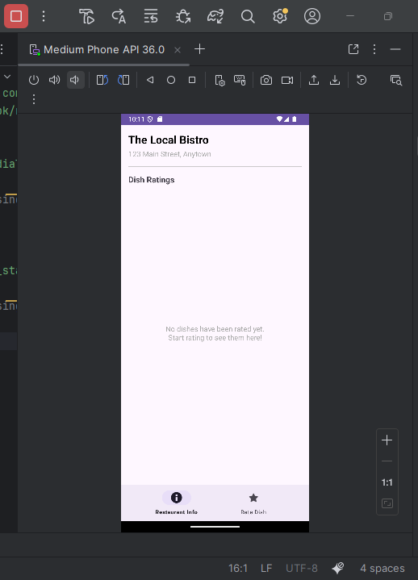
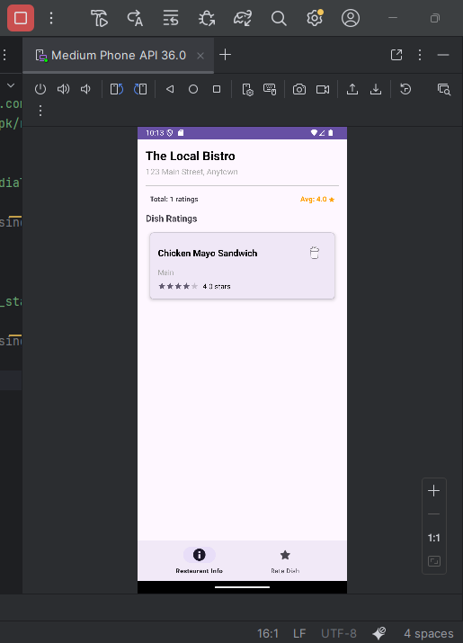
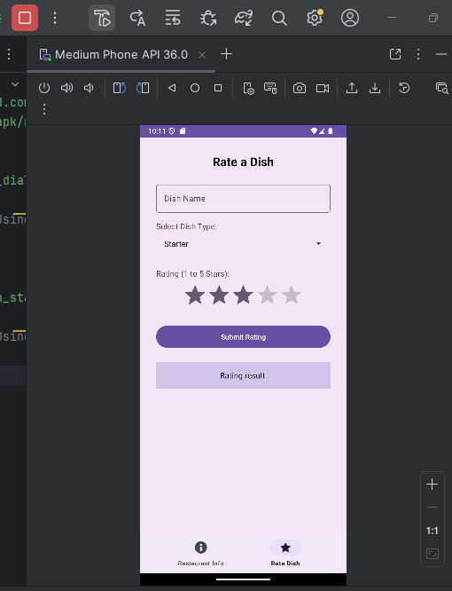

# RestaurantRaterApp

RestaurantRaterApp is an Android application that allows users to view restaurant details and rate dishes using Material Design components and fragment-based navigation.  
The app demonstrates key Android development concepts, including Fragment navigation, ViewModel communication, and **UI interaction**.

---

## Features

### MainActivity
- Hosts a Bottom Navigation View that switches between two main fragments:
  1. RestaurantFragment – Displays the restaurant's name and address (hardcoded or passed via `Bundle`).
  2. DishRatingFragment – Allows users to enter, rate, and view dish details.

---

### RestaurantFragment
- Displays:
  - Restaurant name
  - Restaurant address
- Content is static or dynamically passed through a Bundle.

---

### DishRatingFragment
- Contains:
  - EditText for entering a dish name  
  - Spinner for selecting dish type (starter, main, dessert, beverage)  
  - RatingBar for assigning a rating (1–5 stars)  
  - Button to display the dish information via:
    - Toast notification, or  
    - TextView inside the fragment  

- Ensures real-time user feedback and smooth user interaction.

---

## Fragment Navigation
- Uses FragmentManager and FragmentTransaction for seamless fragment switching.  
- The fragments load dynamically without recreating the entire activity.  

---

## Data Sharing
- Implements a shared ViewModel (or interface communication) for:
  - Passing data between fragments.
  - Maintaining user inputs across navigation.
  - Ensuring a consistent and responsive experience.

---

## Screenshots

### Restaurant Info Fragment
 
 
### Restaurant Info Fragment

---

## Technologies Used
- Language: Java  
- IDE Android Studio  
- Architecture: MVVM (with ViewModel communication)  
- UI Components: Material Design, Fragments, BottomNavigationView  

---

